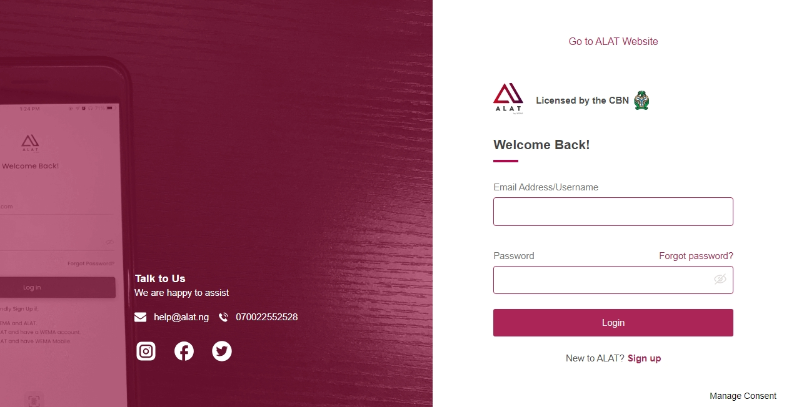
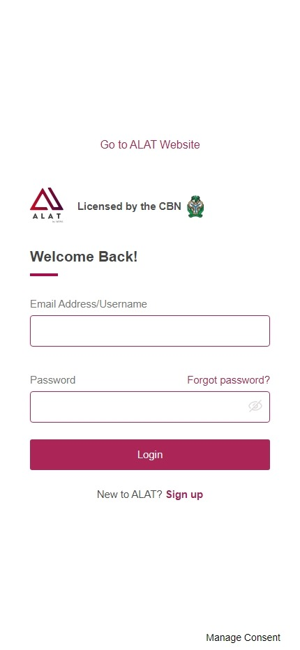

# NextGen Tech Training Program - Assignment: Cloning Alat by Wema Bank Login Page

## Table of Contents

1. [Overview](#overview)
2. [Objectives](#objectives)
3. [Tools and Technologies](#tools-and-technologies)
4. [Process](#process)
   - [1. Set Up Development Environment](#1-set-up-development-environment)
   - [2. Project Structure](#2-project-structure)
   - [3. Develop the Layout and Design](#3-develop-the-layout-and-design)
   - [4. Ensure Responsiveness](#4-ensure-responsiveness)
   - [5. Final Checks](#5-final-checks)
5. [Submission Guideline](#submission-guideline)
6. [Evaluation](#evaluation)
7. [Font](#font)

## Overview

This assignment is part of the NextGen Tech Training Program. It aims to enhance my web development skills by challenging me to replicate the login page of **Alat by Wema Bank**. This project will refine my knowledge of **HTML**, **CSS**, and **responsive design**.

## Objectives

- **Develop** an accurate clone of the Alat by Wema Bank login page.
- **Implement** a responsive design for desktop, tablet, and mobile devices.

## Tools and Technologies

- **HTML5** for page structure.
- **JavaScript** for interactivity.
- **CSS3** for styling.
- **CSS Flexbox** and **Grid** for efficient layout design.

## Screenshot

## Process

### 1. Set Up Development Environment

- Create a project folder named `alat_login_clone`.
- Add a `README.md` file.

### 2. Project Structure

Project includes the following main files:

- `index.html`
- `styles.css`
- `script.js`

Organize code for readability and maintainability.

### 3. Develop the Layout and Design

- **Inspect** the original login page using **Microsoft Edge DevTools**.
- Use **semantic HTML** for better accessibility and SEO.
- Pay close attention to **fonts**, **spacing**, and **colors**.

### 4. Ensure Responsiveness

- Use **media queries** in CSS to create a responsive layout.
- Test the design on various screen sizes for consistency.

### 5. Final Checks

- Compare the design with the original and make necessary adjustments.

## Submission Guideline

- Submit:
  - A link to the **GitHub repository**.

## Evaluation

- **Design Accuracy**: How well the clone matches the original login page.
- **Code Quality**: Code that is readable, organized, and commented.
- **Responsiveness**: Proper display on desktop, tablet, and mobile devices.
- Ensure **cross-browser compatibility** by testing on different browsers.

## font

- **Proxima Nova, sans-serif**

<!-- 
# create a new repository on the command line

-- echo "# fwc_download_link" >> README.md
-- git init
-- git add README.md
-- git commit -m "first commit"
-- git branch -M main
-- git remote add origin **<https://github.com/awoyemipatrick/fwc_download_link.git>**
-- git push -u origin main

## Change the branch name from master to main on the command line

-- git branch -m master main

## push an existing repository from the command line

-- git remote add origin **<https://github.com/awoyemipatrick/fwc_download_link.git>**
-- git branch -M main
-- git push -u origin main -->
